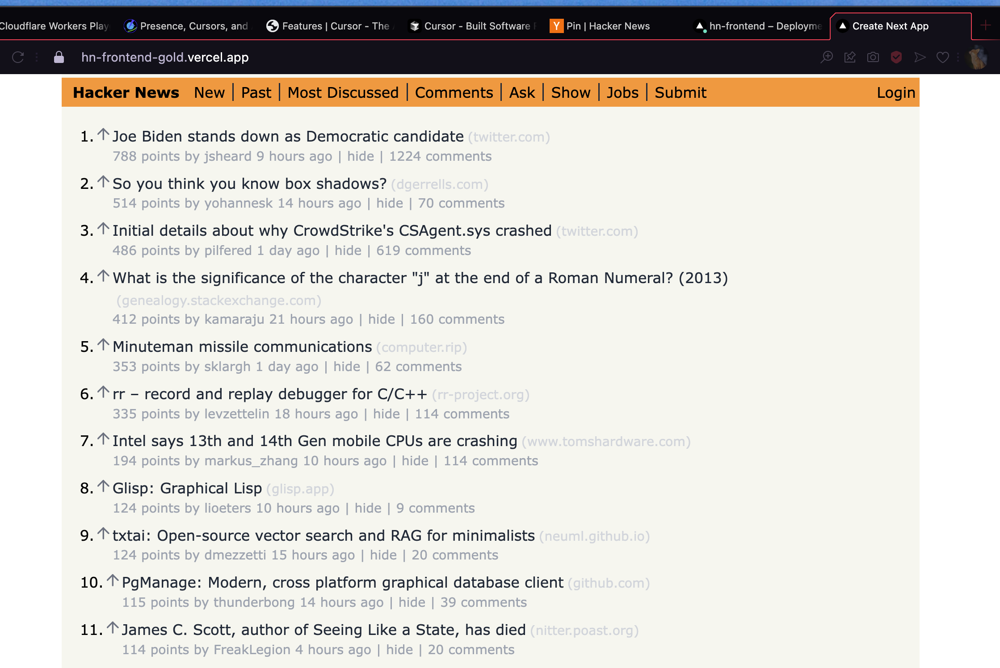

# HN Frontend

This repository contains the frontend code for a Hacker News (HN) reader application built using Next.js. The application fetches and displays various types of Hacker News stories, including new, top, and best stories.

### Features
- **Dynamic Story Fetching**: Fetches the latest stories from Hacker News using their public API.
- **Different Story Types**: Users can view new, top, and best stories from Hacker News.
- **Responsive Layout**: Designed to work on both desktop and mobile devices.

### Pages
- **Home Page**: Displays top stories from Hacker News.
- **New Stories Page**: Shows the latest stories.
- **Top Stories Page**: Lists the top stories based on scores.

### Tech Stack
- **Next.js**: The React framework for production.
- **Tailwind CSS**: For styling components.

### Setup and Running Locally
To get the project running locally:
1. Clone the repository.
2. Install dependencies with `npm install`.
3. Run the development server using `npm run dev`.
4. Open `http://localhost:3000` to view the application in your browser.

### Contribution
Contributions are welcome! Please feel free to submit a pull request or create an issue if you have suggestions for improvements or have identified bugs.

### Deployment
This application is ready to be deployed on platforms like Vercel or Netlify, following the standard Next.js deployment practices.

